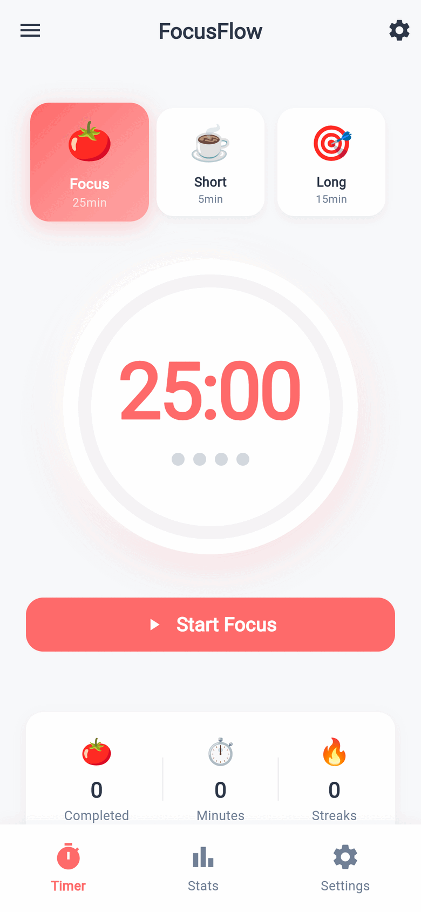
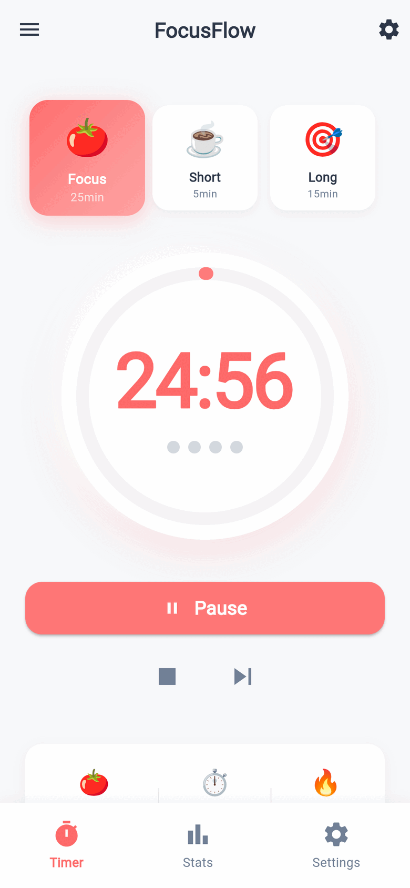
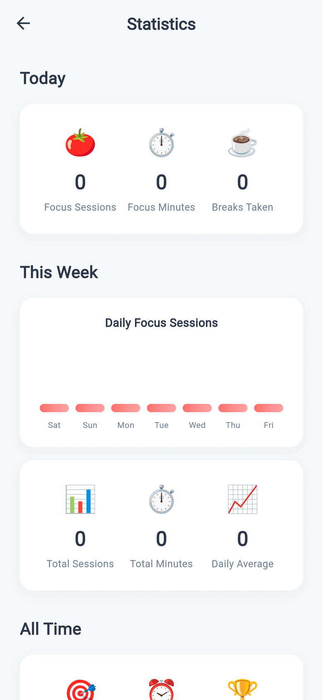
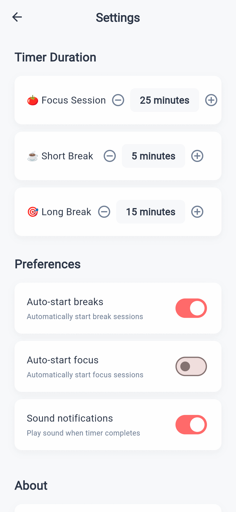

# 🍅 FocusFlow

**A beautiful Pomodoro timer app to help you stay focused and productive.**

تطبيق **FocusFlow** هو مؤقّت Pomodoro أنيق وعصري، مصمَّم لمساعدتك على تنظيم وقتك والحفاظ على تركيزك خلال جلسات العمل. يعتمد التطبيق على تقنية *Pomodoro* الشهيرة التي تقسّم العمل إلى فترات تركيز متبُوعة بفترات راحة قصيرة، مما يعزّز الإنتاجية ويقلّل التشتّت.

<p>
  
  
  
  
</p>

---

## 📸 Screenshots

<table>
  <tr>
    <td align="center" width="25%">
      <br>
      <b>Timer</b><br>
      <sub>شاشة المؤقّت الرئيسية</sub>
    </td>
    <td align="center" width="25%">
      <br>
      <b>Focus Session</b><br>
      <sub>جلسة تركيز نشِطة</sub>
    </td>
    <td align="center" width="25%">
      <br>
      <b>Statistics</b><br>
      <sub>الإحصائيات والتقدّم</sub>
    </td>
    <td align="center" width="25%">
      <br>
      <b>Settings</b><br>
      <sub>الإعدادات والتخصيص</sub>
    </td>
  </tr>
</table>

---

## ✨ Features

| | |
|---|---|
| 🍅 **Pomodoro Timer** | مؤقّت دائري متحرّك مع ثلاث جلسات: تركيز (25د)، راحة قصيرة (5د)، راحة طويلة (15د) |
| ⏯️ **Full Control** | إمكانية التشغيل، الإيقاف المؤقت، إعادة التهيئة، والانتقال بين الجلسات |
| 📊 **Statistics** | تتبّع جلساتك اليومية والأسبوعية والكلية مع رسوم بيانية للتقدّم |
| 🔥 **Streaks** | عدّاد أيام الالتزام المتتالية لتحفيزك على الاستمرار
| ⚙️ **Customizable** | تعديل مدد الجلسات، التبديل بين بدء الراحة/التركيز التلقائي، وتنبيهات صوتية |
| 💾 **Offline Storage** | حفظ كل البيانات محليًا عبر Hive — يعمل التطبيق بدون إنترنت |
| 🎨 **Modern UI** | تصميم نظيف بألوان مريحة ودعم كامل للغة العربية والإنجليزية |

---

## 🛠️ Tech Stack

- **Framework:** [Flutter](https://flutter.dev/) 3.35.4 (Dart 3.9.2)
- **State Management:** [Provider](https://pub.dev/packages/provider) 6.1.5+1
- **Local Database:** [Hive](https://pub.dev/packages/hive) 2.2.3 + [hive_flutter](https://pub.dev/packages/hive_flutter) 1.1.0
- **Key–Value Storage:** [shared_preferences](https://pub.dev/packages/shared_preferences) 2.5.3
- **Targets:** Android & Web

---

## 📂 Project Structure

```
lib/
├── main.dart                    # نقطة انطلاق التطبيق والإعدادات
├── models/
│   └── pomodoro_session.dart    # نموذج بيانات جلسة Pomodoro
├── screens/
│   ├── timer_screen.dart        # شاشة المؤقّت الرئيسية
│   ├── statistics_screen.dart   # شاشة الإحصائيات
│   └── settings_screen.dart     # شاشة الإعدادات
├── services/
│   ├── timer_service.dart       # منطق المؤقّت وإدارة الحالة
│   ├── statistics_service.dart  # حساب الإحصائيات
│   └── storage_service.dart     # التخزين المحلي (Hive)
├── widgets/
│   └── circular_timer.dart      # الودجت الدائري للمؤقّت
└── theme/
    └── app_theme.dart           # الألوان والثيم الموحّد
```

---

## 🚀 Getting Started

### Prerequisites

- Flutter SDK **3.35.4** أو أحدث
- Dart **3.9.2** أو أحدث

### Installation

```bash
# 1. استنساخ المستودع
git clone https://github.com/Marwan-Saif/Bomodror.git
cd Bomodror

# 2. تثبيت التبعيات
flutter pub get

# 3. تشغيل التطبيق
flutter run
```

### Build for Web

```bash
flutter build web --release
```

### Build & Release (Android)

```bash
# بناء App Bundle موقّع للنشر على Google Play
flutter build appbundle --release

# أو بناء APK مباشر
flutter build apk --release
```

> **ملاحظة:** يتطلّب بناء الإصدار (release) ملفات التوقيع `android/key.properties` و `android/release-key.jks`، وهي غير مُضمّنة في المستودع لأسباب أمنية.

---

## 📄 License

هذا المشروع متاح تحت رخصة **MIT**. راجع ملف [LICENSE](LICENSE) لمزيد من التفاصيل.

---

<p align="center">
  صُنع بـ ❤️ باستخدام Flutter
</p>
